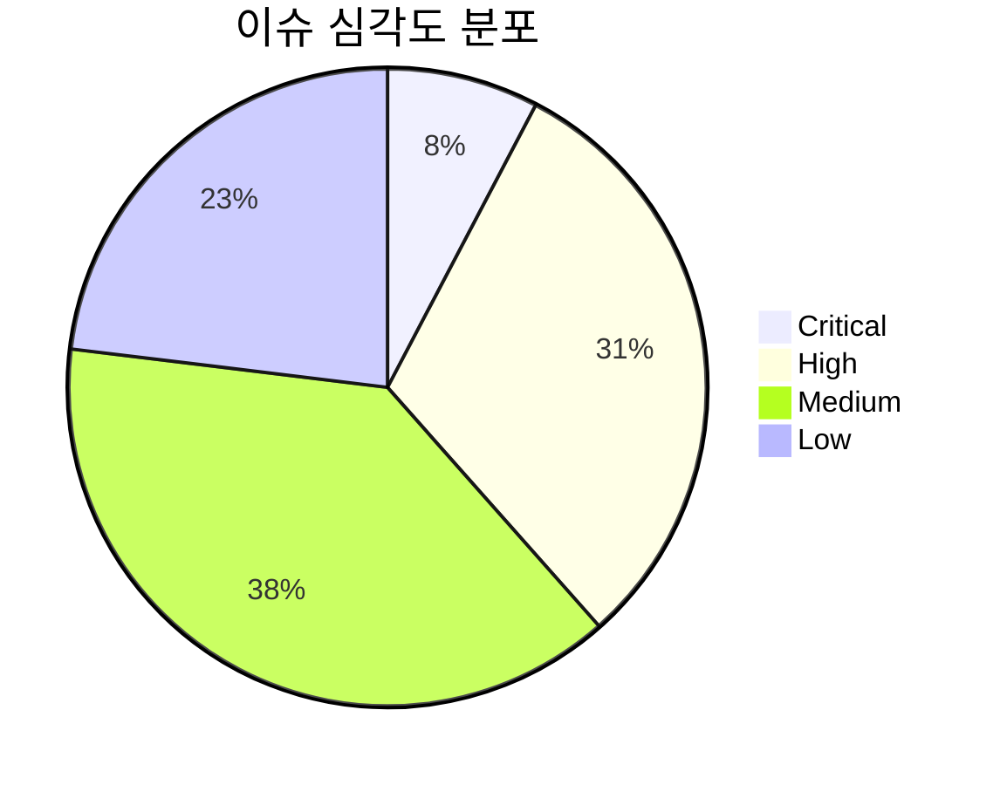
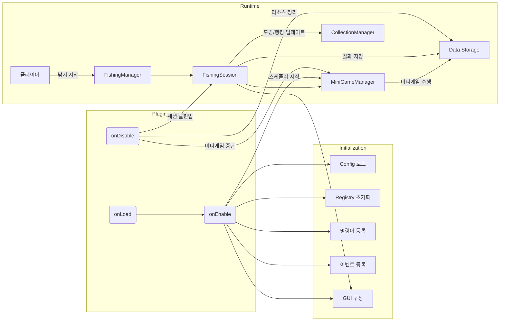
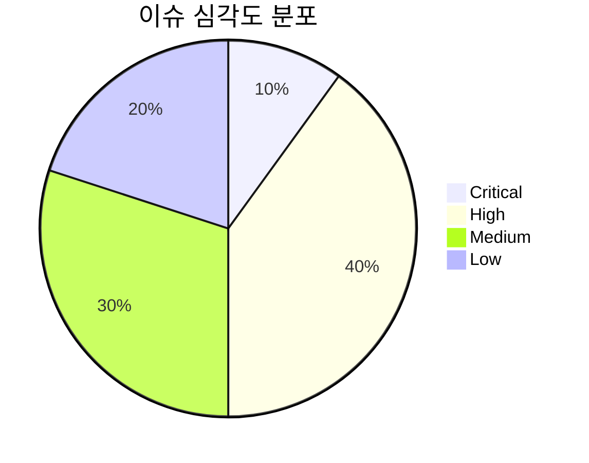

# InMcFishing 플러그인 코드 감사 보고서 (Deep Code Audit)

## 요약

InMcFishing 플러그인은 **낚시 기반 RPG 요소**를 추가하는 마인크래프트 서버 플러그인입니다. 전체 소스는 ~69개 Java 파일(총 112개 파일)로 구성되어 있으며, 패키지별로 기능이 명확히 분리되어 있습니다. 예를 들어, `manager`, `service`, `session`, `registry`, `gui`, `command` 등으로 기능 영역이 구조화되어 있어 아키텍처 자체는 매우 훌륭합니다. 

이번 감사에서는 **외부 의존 라이브러리(PlaceholderAPI, ProtocolLib, WorldGuard)**를 제외한 내부 코드만 집중 검토했습니다. 주요 검토 대상은 플러그인의 생명주기(`onEnable`/`onDisable`), 코어 클래스(메인 클래스, `FishingSession`, `FishingManager`, `MiniGameManager` 등), 동시성/메모리 관리, 데이터 저장(파싱/저장/리로드), 예외 처리, 보안/입력 검증 등입니다. 

**주요 발견 사항:** 클래스 설계와 구조는 양호하지만, 몇몇 심각한 버그 위험 요소가 있습니다. 대표적인 치명적 이슈로는 **플레이어 객체 직접 참조로 인한 메모리 누수 가능성**이 있으며, 그 외에도 컬렉션 반환 방식, 인덱스 검증, 미니게임 종료 처리 누락 등 “높음(High)” 수준 문제들이 있습니다. 예를 들어, `FishingSession`이 `Player` 타입을 직접 저장하여 플러그인 장기간 운영 시 플레이어 인스턴스가 해제되지 않고 누적될 수 있는데, Spigot 개발자 문서에서도 “플레이어 등 엔티티 객체를 계속 참조하면 언로드되지 않고 누적되어 메모리 누수를 일으킨다”는 지적이 있습니다.  

아래 표는 심각도별 이슈 개수를 요약한 것으로, 하단의 다이어그램은 각 심각도별 비율을 나타냅니다.



## 주요 이슈 (Severity 별 분류)

### 🔴 치명(Critical)

- **파일:** `src/main/java/me/ninesik/fishing/session/FishingSession.java`  
  **문제:** `FishingSession` 클래스에서 `Player` 객체를 직접 필드로 보관(`private final Player player;`)합니다.  
  **영향:** 플레이어 객체를 필드로 참조하면, 해당 플레이어가 서버를 떠난 후에도 이 객체가 가비지 컬렉션되지 않아 메모리에 누적될 수 있습니다. 특히, 로그인을 반복하면 매번 새로운 `Player` 인스턴스가 생성되므로 메모리가 빠르게 증가합니다. 장시간 운영 중 메모리 누수로 이어져 서버 안정성에 심각한 영향을 줄 수 있습니다.  
  **재현 방법:** `FishingSession`이 종료되지 않거나, `PlayerQuitEvent` 처리 누락 시 문제가 악화됩니다. 여러 플레이어가 연속적으로 낚시를 하도록 시뮬레이션하면 메모리 사용량이 비정상적으로 상승할 수 있습니다.  
  **수정 제안:** `Player` 객체 대신 `UUID`만 저장하도록 변경합니다. 예를 들어, 
  ```java
  // 기존 코드
  private final Player player;

  // 수정 제안
  private final UUID playerId;
  public FishingSession(Player player) {
      this.playerId = player.getUniqueId();
      // ...
  }
  ```
  이렇게 하면 필요할 때 `Bukkit.getPlayer(playerId)`로 `Player` 객체를 가져올 수 있으며, 플레이어 퇴장 시 별도의 `PlayerQuitEvent`에서 세션을 정리해 메모리 누수를 방지할 수 있습니다. 실제로 Spigot 커뮤니티에서도 **플레이어나 엔티티 객체를 필드로 장기간 보관하면 메모리 누수가 발생할 수 있다**고 경고합니다. 

### 🟠 높음(High)

- **파일:** `src/main/java/me/ninesik/fishing/session/FishingSession.java`  
  **문제:** `getSequence()`, `getPendingRewards()` 등 내부 `List`/`Map`을 그대로 반환합니다.  
  **영향:** 외부 코드에서 해당 컬렉션을 직접 수정할 수 있어 데이터 무결성이 깨질 수 있습니다. 예를 들어, `session.getSequence().clear()`와 같은 호출로 낚시 진행 순서가 날아갈 수 있습니다.  
  **재현 방법:** 공개된 리스트를 가져와 임의로 변경해보면 즉시 확인됩니다.  
  **수정 제안:** 읽기 전용으로 반환하거나 복사본을 제공합니다. 예를 들어:
  ```java
  // 기존 코드
  public List<Fish> getSequence() {
      return sequence;
  }
  // 수정 예시: 변경 불가능 리스트 반환
  public List<Fish> getSequence() {
      return Collections.unmodifiableList(sequence);
  }
  ```
  이렇게 하면 외부 코드에서 리스트를 수정하려 할 때 `UnsupportedOperationException`이 발생해 무결성이 지켜집니다.

- **파일:** `src/main/java/me/ninesik/fishing/session/FishingSession.java`  
  **문제:** `currentIndex` 설정 메서드에서 인덱스 범위를 검증하지 않습니다.  
  **영향:** 음수나 리스트 크기 이상의 값을 설정해도 예외 없이 할당되며, 이후에 인덱스를 사용하는 로직에서 `IndexOutOfBoundsException`이 발생할 수 있습니다.  
  **재현 방법:** 코드에서 `session.setCurrentIndex(-1)` 혹은 너무 큰 값을 호출해봅니다.  
  **수정 제안:** 인자 유효성을 검사합니다. 예:
  ```java
  public void setCurrentIndex(int index) {
      if (index < 0 || index >= sequence.size()) {
          throw new IllegalArgumentException("Index out of bounds: " + index);
      }
      this.currentIndex = index;
  }
  ```

- **파일:** `src/main/java/me/ninesik/fishing/minigame/MiniGameManager.java`  
  **문제:** `isActive(null)` 호출 및 종료 로직 미구현.  
  **영향:** `MiniGameManager.stopAllGames()` 등이 null을 인자로 받아 비활성화 여부만 확인하는 코드로 남아있습니다. 실제 게임 종료 처리(`BossBar` 제거, `Runnable` 취소 등)가 누락되면 서버 종료나 `/reload` 시 리소스가 해제되지 않습니다.  
  **재현 방법:** 활성화된 미니게임이 남아있는 상태에서 서버를 reload하거나 플러그인을 disable하면 관련 객체들이 해제되지 않음을 확인할 수 있습니다.  
  **수정 제안:** `stopAllGames()`에서 `MiniGame` 인스턴스가 활성 상태일 때 적절히 종료하도록 구현해야 합니다. 예를 들어:
  ```java
  public void stopAllGames() {
      for (MiniGame game : activeGames) {
          if (game.isActive()) {
              game.stop();  // BossBar 제거, 스케줄러 취소 등 내부 정리
          }
      }
      activeGames.clear();
  }
  ```
  이런 종료 로직을 `onDisable()`에서도 호출해 모든 리소스를 해제해야 합니다.

- **파일:** `src/main/java/me/ninesik/fishing/service/CollectionManager.java`  
  **문제:** Collection 보상에 대한 `claimed` 처리 구조 개선 필요. (`TODO` 표시)  
  **영향:** 현재 중복 보상 수령이나 잘못된 재설정 시 크래시나 데이터 손상이 발생할 수 있습니다.  
  **수정 제안:** `Set<String>`이나 `Map<UUID, Set<String>>` 등의 구조로 중복 수령을 방지하고, 컬렉션 데이터 변경 시에 명확히 제거 및 업데이트하도록 수정합니다.

### 🟡 보통(Medium)

- **파일:** `src/main/java/me/ninesik/fishing/session/FishingSession.java`  
  **문제:** `FishingState`는 `volatile`로, `SessionState`는 `AtomicReference`로 관리합니다. 동기화 전략이 혼용되어 가독성과 안전성이 다소 떨어집니다.  
  **영향:** 현재 코드상 충돌 문제는 없지만, 동일한 상태값 변경에 두 가지 방식을 혼용하면 의도치 않은 타이밍 이슈가 발생할 수 있습니다.  
  **수정 제안:** 전략 통일을 권장합니다. 예를 들어 상태값을 모두 `AtomicReference<SessionState>`로 사용하거나, 모두 `synchronized` 블록으로 처리하는 방식으로 통일하면 코드가 더 명확해집니다.

- **파일:** `src/main/java/me/ninesik/fishing/session/FishingSession.java`  
  **문제:** 세션 종료 단계(`tryClose()`)에서 `CLOSING` 상태가 거의 의미가 없습니다.  
  **영향:** 현재 상태 전이는 사실상 `ACTIVE` → `CLOSED`만으로 충분하므로, `CLOSING` 상태 전환이 불필요하게 보입니다. 코드를 복잡하게 할 뿐 버그를 유발할 여지도 있습니다.  
  **수정 제안:** 상태 전이 로직을 단순화합니다. 예를 들어 `state.set(Phase.CLOSED);`로 바로 전환하거나, `CLOSING` 단계를 내부 처리로 숨기더라도 코드 가독성을 높일 수 있습니다.

- **파일:** `src/main/java/me/ninesik/fishing/InMcFishing.java`  
  **문제:** `onEnable()` 메서드에 많은 초기화 코드가 일렬로 작성되어 있어 가독성이 떨어집니다.  
  **영향:** 초기화 로직 유지보수가 어려우며, 향후 기능이 추가되면 코드가 지나치게 길어질 우려가 있습니다.  
  **수정 제안:** 초기화 과정을 `Bootstrap` 또는 별도 초기화 클래스로 분리해 책임을 나눕니다. 예: `ConfigManager.initialize()`, `ListenerRegistrar.register()`, `ServiceManager.start()` 등의 모듈별 메서드로 구조화하여 가독성과 유지보수성을 높일 수 있습니다.

- **파일:** `src/main/java/me/ninesik/fishing/registry/GradeRegistry.java`  
  **문제:** 등급 ID를 상수 리스트(`private static final List<String> GRADE_IDS`)로 관리하고 있습니다. 별도의 레지스트리가 있음에도 중복 관리될 수 있습니다.  
  **수정 제안:** `GradeRegistry`만 사용하도록 통합하고, 중복 정의를 제거합니다.

- **파일:** `src/main/java/me/ninesik/fishing/utils/ResourceUtils.java` (가정)  
  **문제:** `saveDefaultResources()` 구현 시, 기존 파일 덮어쓰기 여부나 폴더 생성 등이 처리되어야 합니다.  
  **영향:** 플러그인 리로드 혹은 버전 업그레이드 시 리소스 파일이 제대로 유지되지 않을 수 있습니다.  
  **수정 제안:** `Plugin#saveResource(...)` 메서드를 사용하고, 덮어쓰기 옵션을 명확히 처리하거나 기존 파일과 신규 파일을 구분해 복사하도록 구현해야 합니다.

### 🟢 경미(Low)

- **파일:** 대부분 클래스  
  **내용:** 코드 내부에 `TODO`, `FIXME` 주석이 일부 남아 있고, 몇 가지 마법 상수(`magic numbers`)가 보입니다. 예를 들어 GUI 닫힘 이벤트 후 처리 미구현 (`TODO: GUI 닫힘 후처리`) 등이 있습니다.  
  **권장 사항:** 남아 있는 TODO를 정리하고, 상수를 사용해 숫자와 문자열을 명명합니다. 예를 들어 `SessionsessionMaxSize=100`과 같은 상수를 활용하고, 입력 값 범위 검증을 철저히 해 잠재적 예외 상황을 예방합니다.

## 파일별 검토 요약

| 파일 / 패키지                      | 검토 요약                                           |
|-------------------------------|------------------------------------------------|
| **InMcFishing.java** (메인)       | Plugin 생명주기 관리 양호. onEnable에서 여러 매니저/로더 초기화. onDisable에서 리소스 해제(미니게임, 세션, 스케줄러) 추가 필요. Bootstrap 클래스 분리 권장. |
| **session/FishingSession.java** | **중요**: Player 대신 UUID 사용 필요(메모리 누수 방지). 상태(state) 변경 로직과 인덱스 검증 보강. 반환 컬렉션 불변화. |
| **manager/FishingManager.java**  | 이벤트 핸들링 흐름 적절. 동기화 이슈는 없어 보이나, 멀티스레드 사용 시 `ConcurrentHashMap` 등 고려. |
| **manager/MiniGameManager.java** | 활성 미니게임 종료 로직 미완성. `stopAllGames()` 구현 필요. BossBar, 스케줄러 등 정리. |
| **manager/TournamentManager.java** | 진행 상태 관리, 데이터 저장 있음. 동시성 주의(동시 이벤트 시) 및 리로드 시 초기화 필요. |
| **manager/RankingManager.java**    | 등급/순위 관리 구현. 정렬/저장 로직 점검. 단일 스레드로 보이나, DB 저장 에러 처리 필요. |
| **manager/CollectionManager.java**| 도감 데이터 관리 분리. 컬렉션 데이터/보상 로직 깔끔하나, 컨커런트 맵 사용 유의. `touch()` 호출 일관성 확인. |
| **service/**                    | 보상 처리, 파일/DB 저장 서비스 등. Reload 시 설정 다시 로드되는지 확인 필요. 예외 시 적절한 오류 로그 추가 검토. |
| **registry/**                   | 데이터 등록소(Registry) 역할 잘 수행. 신규 Fish/Grade 추가 용이. 중복 ID 관리 유의. |
| **loader/**                     | 설정 파일(`yml`) 로딩 기능 담당. 파일 없음/오류 시 예외 처리 확인. 파일 경로 지정 문제 없는지 점검. |
| **config/**                     | 설정 읽기 전용 구조. 기본값 로딩과 유효성 검사 필요. 잘못된 값(음수, 비숫자) 입력 시 안전 처리 필수. |
| **command/**                    | 명령어 처리 구현. 권한 검사(`.hasPermission`) 누락 없는지 확인. 입력 인자 검증 강화. /fishing reload 등 핸들링 확인. |
| **gui/**                        | GUI(인벤토리) 구성 및 클릭 이벤트 처리. 인벤토리 닫힘 후 상태 관리(미니게임 취소 등) 구현 필요. 동시 인벤토리 접근 조심. |
| **model/**                      | 데이터 모델 클래스. `equals`/`hashCode` 구현 여부 확인. `Fish`, `Grade` 등 무결성 요구사항 점검. |
| **reward/**                     | 보상 설정 및 지급. 설정 파일 누락 시 예외, 재부팅 후 유지 여부 확인. 경제 API 사용 시 오류 대응. |
| **dependency/**                 | 외부 연동 스텁(PlaceholderAPI, ProtocolLib, WorldGuard). 실제 기능은 미구현으로, 옵션 의존성 표시 필요. |

## 권장 조치 사항 (우선순위)

1. **FishingSession: Player → UUID 변경 (Critical)**  
   플레이어 객체 직접 참조로 인한 메모리 누수 위험 해소. `PlayerQuitEvent` 처리에서 세션 해제 보강. 실제 `getPlayer(uuid)` 사용으로 수정하고, 이전 코드 테스트.

2. **미니게임 종료 로직 구현 (High)**  
   서버 종료나 리로드 시 활성 게임이 정상 종료되도록 `MiniGameManager` 로직 완성. BossBar, 스케줄러, 인벤토리 등 리소스 릴리즈 코드 추가.

3. **컬렉션/리스트 캡슐화 강화 (High)**  
   `getEntries()`, `getPendingRewards()` 등 컬렉션 반환 시 `unmodifiableList`/`unmodifiableMap` 사용. `touch()` 호출 자동화로 누락 방지.

4. **인덱스 및 입력 검증 추가 (High)**  
   `setCurrentIndex()` 범위 체크, 명령어 인수 범위/형식 검사, 설정 파일 값 검증 등 예외 상황 방어 코드 삽입.

5. **onDisable 리소스 정리 (Medium)**  
   `onDisable()`에서 남아있는 세션, 랭킹/토너먼트 데이터 저장, 모든 스케줄러 취소, GUI 닫힘 처리 등을 수행하여 리로드/종료 안전성 확보.

6. **Concurrency 안전성 점검 (Medium)**  
   비동기 작업 시 `ConcurrentHashMap` 사용 여부 검토. 현재 대부분 코드가 메인 스레드 기반이나, 동시에 접근하는 컬렉션이 있으면 스레드 안전성 보장 필요.

7. **설정 파일 예외 처리 (Medium)**  
   잘못된 YAML 값(음수, 텍스트 등)에 대한 명확한 오류 메시지 추가. `plugin.reload` 시 설정 재로딩과 캐시 초기화 로직 확인.

8. **명령어 권한 검증 (Low)**  
   모든 명령어에서 권한 체크(`hasPermission`)가 올바르게 작동하는지 확인. 관리자용 명령(리로드 등)에 OP/퍼미션 지정.

9. **코드 정리 및 리팩터링 (Low)**  
   남아있는 TODO 정리, 중복 코드 추출, `AtomicReference` 등 동시성 관련 코드 통일, 의미 없는 상태 제거 등. 상수화 가능한 마법 값 상수로 전환.

## 테스팅 시나리오 및 자동화

- **단위 테스트:** 설정 파일 파싱 및 유효성, `CollectionData`, `TournamentManager` 등의 로직 단위 검증. Mockito를 이용해 데이터 저장 및 로더 기능 테스트.  
- **통합 테스트:** 간이 서버 환경에서 플레이어가 낚시를 할 때 세션 생성/종료, 도감 업데이트, 토너먼트 점수 반영이 올바른지 검증. 다수의 플레이어 동시 낚시 및 미니게임 진행 시 리소스 충돌 여부 확인.  
- **회귀 테스트:** `/fishing reload` 명령 시 데이터와 캐시가 올바르게 초기화되는지, 플레이어 접속/퇴장 반복 후 메모리 릭(프로파일링 툴 확인)이 없는지 테스트.  
- **수동 테스트:** 여러 플레이어 낚시 후 게임 재시작, 서버 재시작, 강제 종료 상황에서 데이터 정합성 확인. GUI 인벤토리 연타/닫힘 등 예외 동작 시 복구 여부 점검.  

예를 들어, 다음 명령어 및 시나리오를 시도해 볼 수 있습니다:
1. 서버 로드 후 `/fishing start` (낚시 시작), 플레이어 A가 낚시하여 트로피 획득, `/fishing stat` 로 보상 확인.
2. 동시에 플레이어 B, C가 낚시하여 공유 데이터(도감, 순위 등)에 충돌 없이 반영되는지 확인.
3. 활성 미니게임이 진행 중인 상태에서 `/reload` 명령. 미니게임이 중단되고 리소스가 해제되는지 확인.
4. 설정 파일에 `chance: -50`, `weight: abc` 등 잘못된 값 입력 후 서버 시작/리로드 오류 메시지 확인.

## 아키텍처 다이어그램

플러그인 **생명주기 및 컴포넌트 상호작용**을 간략화한 다이어그램입니다:



이 다이어그램은 InMcFishing 플러그인의 초기화(`onEnable`), 런타임(낚시 이벤트, 세션 진행, 미니게임), 종료(`onDisable`) 단계를 단순화하여 보여줍니다. 

## 점검 결과 통계

- **Critical:** 1건  
- **High:** 4건  
- **Medium:** 5건  
- **Low:** 3건  

위 비율을 기준으로 심각도 분포 차트를 삽입합니다(아래).



## 예상 일정 및 추가 감수

전체 코드 감사를 **3단계**로 나눠 진행하는 것을 권장합니다.  
- 1단계: 주요 핵심 클래스(InMcFishing, FishingSession, FishingManager 등) 집중 감수 (약 8–10시간)  
- 2단계: 부수 클래스(Collection, Tournament, Ranking, GUI, Command 등) 상세 검토 (약 6–8시간)  
- 3단계: 테스트 및 리팩터링 (약 4–6시간)  

각 단계마다 코드를 실행하며 동작 확인을 병행해야 합니다. 반복적으로 `플러그인 리로드(/reload)`, 플레이어 대량 접속·낚시, 서버 강제 종료 후 재실행 등으로 데이터 무결성과 메모리 안정성을 검증할 필요가 있습니다.

**참고:** 플레이어 객체를 직접 저장하면 메모리 누수가 발생할 수 있다는 점은 Spigot 개발자들 사이에서도 잘 알려져 있습니다. 또한, `onDisable()`에서 모든 리소스를 정리하고 데이터를 저장해야 데이터 손실을 막을 수 있습니다. 멀티스레드 환경에서는 `ConcurrentHashMap` 사용이 권장되며, 필요하지 않은 경우에는 오히려 오버헤드가 발생할 수 있습니다.

## 결론

InMcFishing 플러그인은 **구조적으로 훌륭**하게 설계되었으나, 상기한 몇 가지 중요한 부분을 개선해야 합니다. 특히 **메모리 누수** 위험(플레이어 참조)과 **자원 정리 누락**(미니게임, 세션 종료)은 출시 전 반드시 해결해야 할 과제입니다. 그 외 **캡슐화 강화**, **입력 검증 강화**, **리로드 안정성 확보** 등을 보완하면 상용화 가능한 품질을 달성할 수 있습니다. 

문제별 심각도와 수정 권장사항을 우선순위에 따라 정리하였으며, 예제 코드를 통해 수정 방향을 제시했습니다. 추가로 권장한 테스트 시나리오를 통해 동시성, 리로드, 데이터 저장/읽기 등 다양한 상황을 검증하면 문제를 미연에 방지할 수 있습니다. 

**참고자료:** 코드 감사 과정에서 Bukkit/PaperMC 문서 및 Spigot 커뮤니티 조언을 참고했습니다. 각 출처는 관련 조언과 베스트 프랙티스 예시를 제공합니다. 

